# Mapped Drive Backup & File Recovery Troubleshooting Lab


## Objective
Simulate a real-world IT support issue where a user reports that files from a mapped network drive are missing. Configure a shared folder and drive mapping through Group Policy, protect the data with Windows Server Backup, simulate file loss, recover the missing data, and verify that access is restored from the client side.

---

## Lab Environment
- Windows Server 2019 Virtual Machine
- Windows 11 Pro Virtual Machine
- Active Directory Domain Services (AD DS)
- Group Policy Management (GPO)
- Windows Server Backup
- Spiceworks Ticketing System

---

## Steps

### 1. Created the Shared Folder
Created a `Sales` shared folder on the server and added sample business files to simulate company data that users access through the network. 

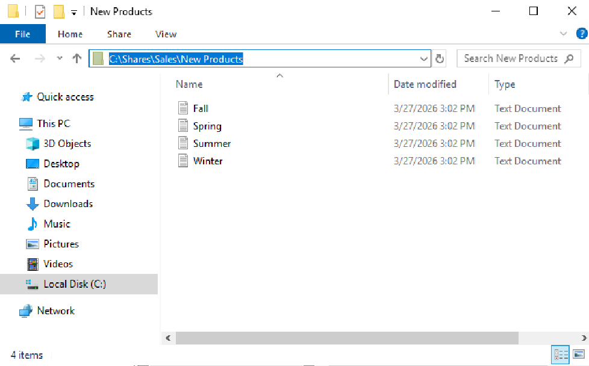

---

### 2. Configured Network Share
Configured the Sales folder as a network share so it could be reached by users across the domain via Network Path: `\\HOME-LAB\Sales`.

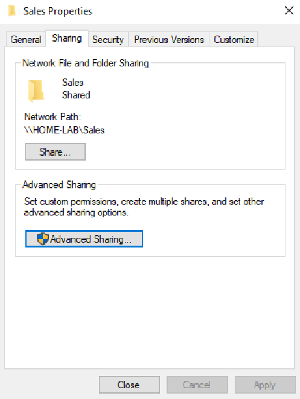

---

### 3. Configured Drive Mapping Policy
Created a Group Policy to automatically map the Sales network share to the `S:` drive for users. Linked the drive mapping policy to the correct Organizational Unit `Sales_Users` so it would apply to the intended user account through Item-Level Targeting. 

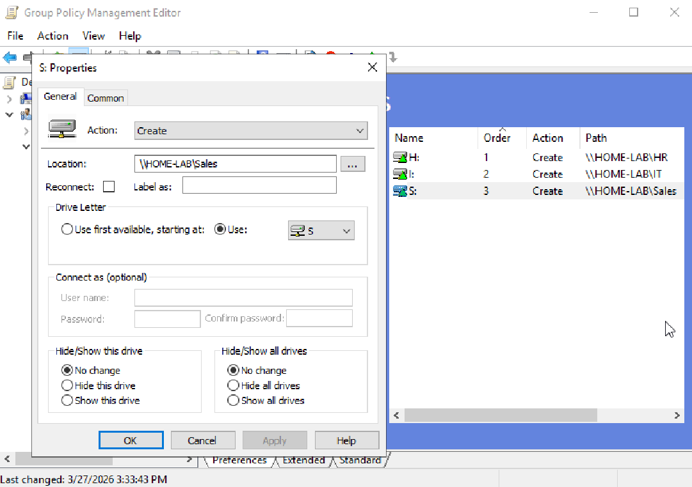

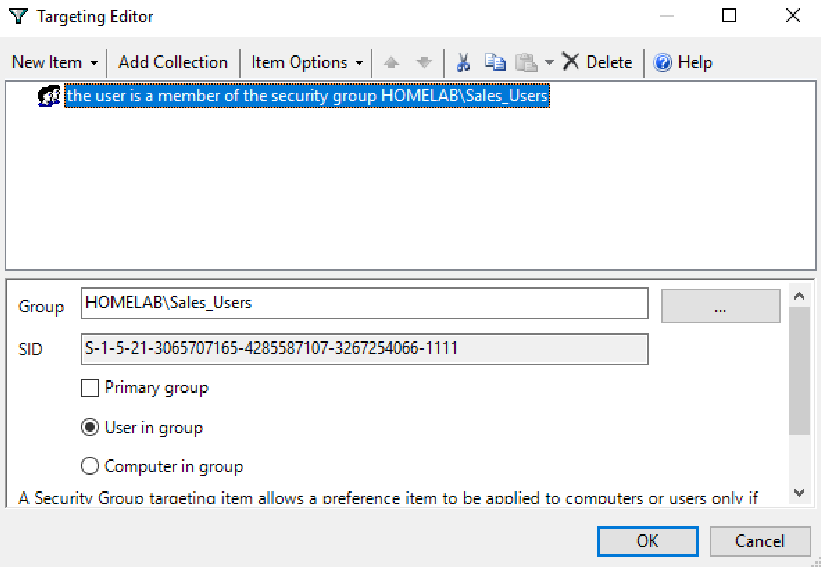

---

### 4. Verified Mapped Drive Access
Updated group policy using `gpupdate` on the client and confirmed that the S: drive appeared with the shared files available to the user.

**Command Used**
```
gpupdate /force
```

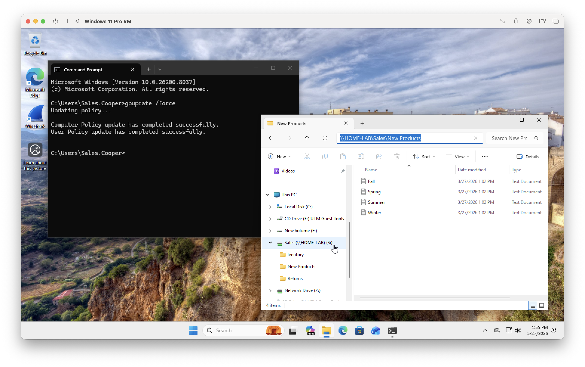

---

### 5. Installed and Configured Backup Protection
Installed Windows Server Backup under Add Roles and Features. A secondary virtual disk was created in UTM, formatted as NTFS, and assigned as `B:` to meet Windows Server Backup requirements for separate storage. Configured the backup and selected the dedicated destination drive to protect the shared `Sales` data.

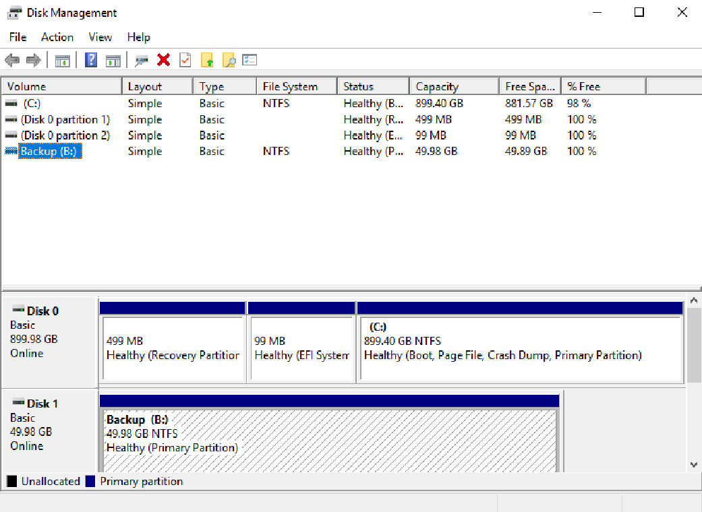

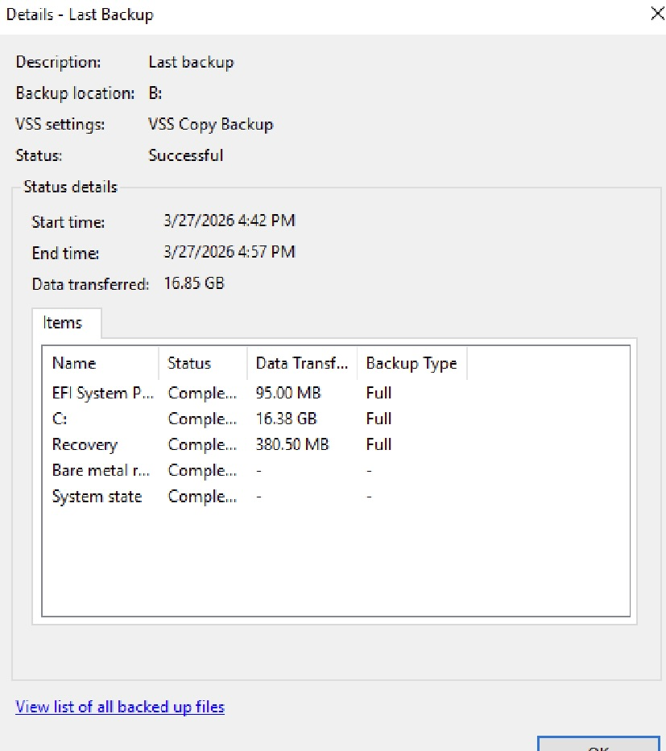

---

### 6. Confirmed Successful Backup
Confirmed the backup was successful by running the backup job and validating recoverability through the Recovery Wizard, ensuring shared folder data was accessible and protected prior to simulating the issue.

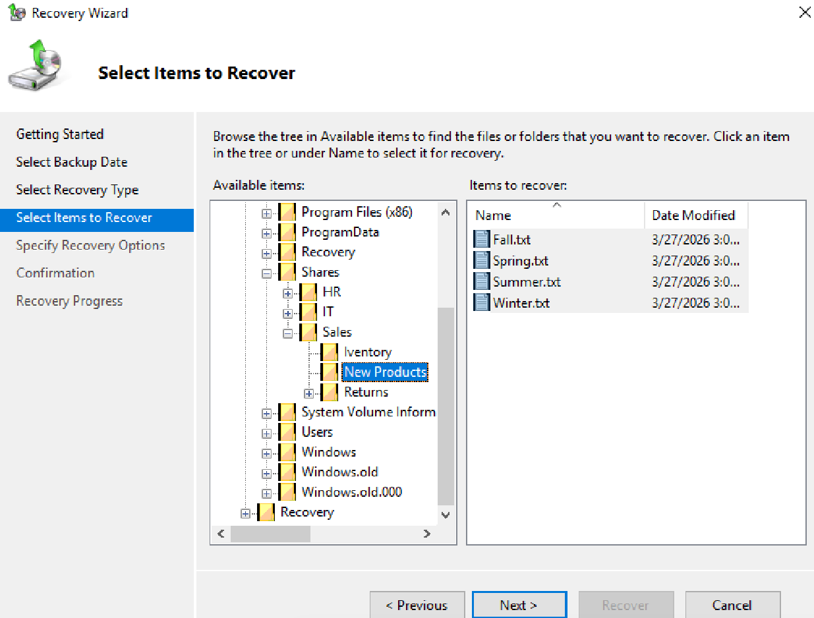

---

### 7. Simulated File Loss
Simulated a real support issue by removing the shared files and confirmed that the mapped drive no longer showed the expected data.

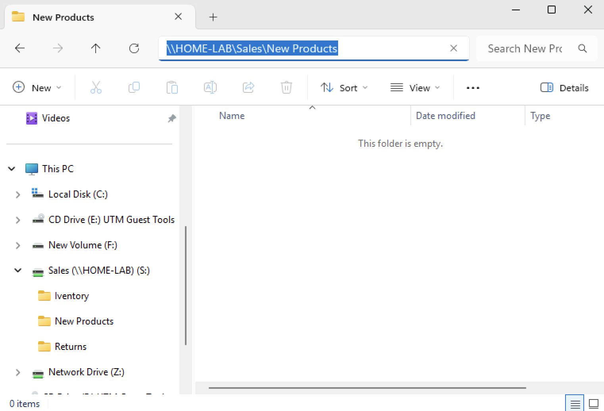

---

### 8. Opened Support Ticket in Spiceworks
A user reports that all files from their mapped `S:` drive are missing. The drive is still mapped, but the shared business files are no longer available. Support ticket has been received.

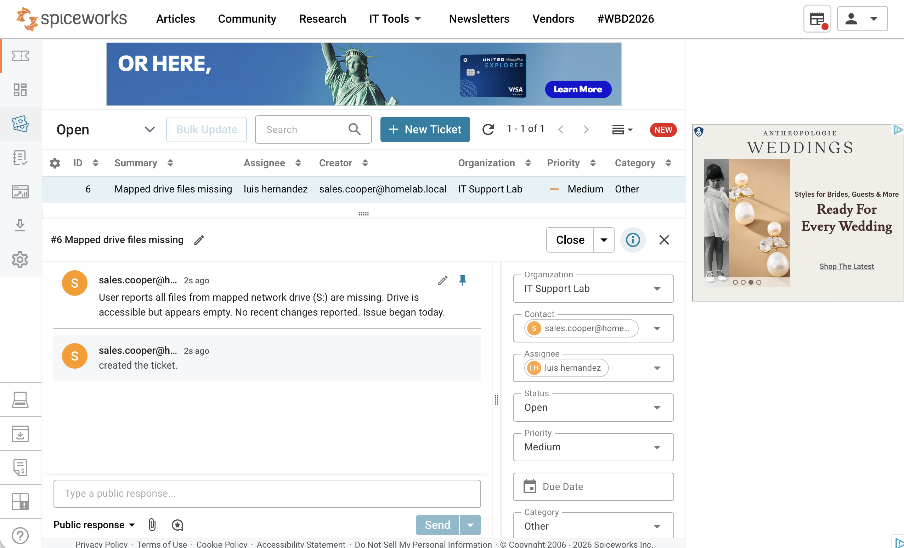

---

### 9. Recovered Files from Backup
Used Windows Server Backup to recover the missing `Sales` files from the available backup set.

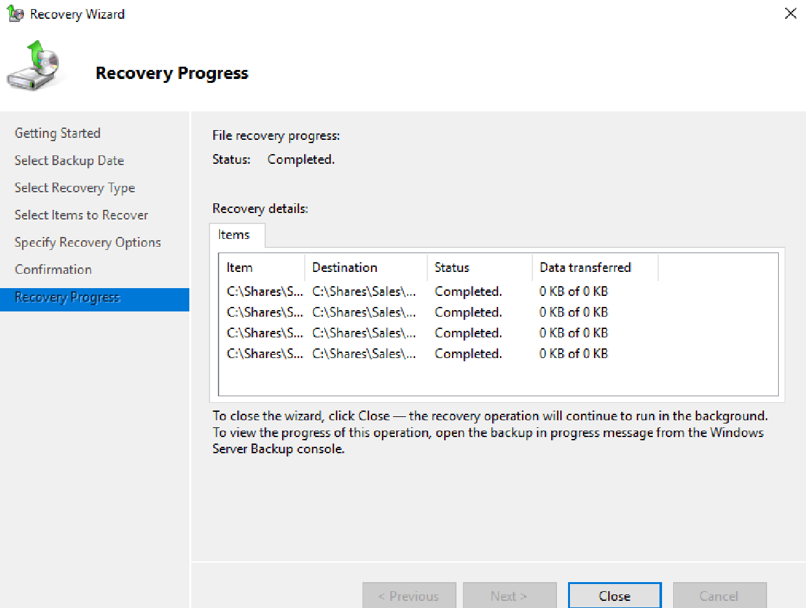

---

### 10. Verified File Recovery
Confirmed that the deleted files were restored on the server and became available again through the mapped `S:` drive on the client machine.

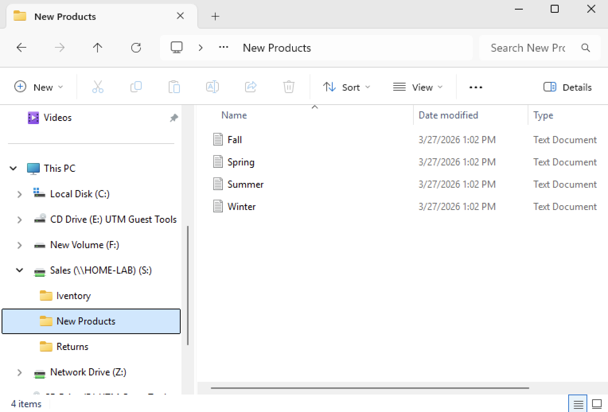

---

### 11. Closed Ticket After Resolution
Updated the support ticket with the recovery steps taken, verified the fix from the user side, and closed the case.

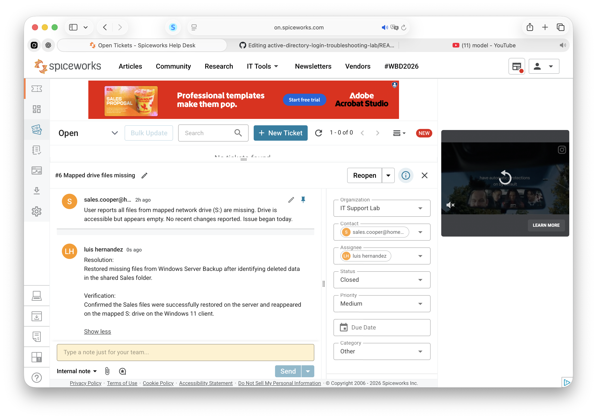

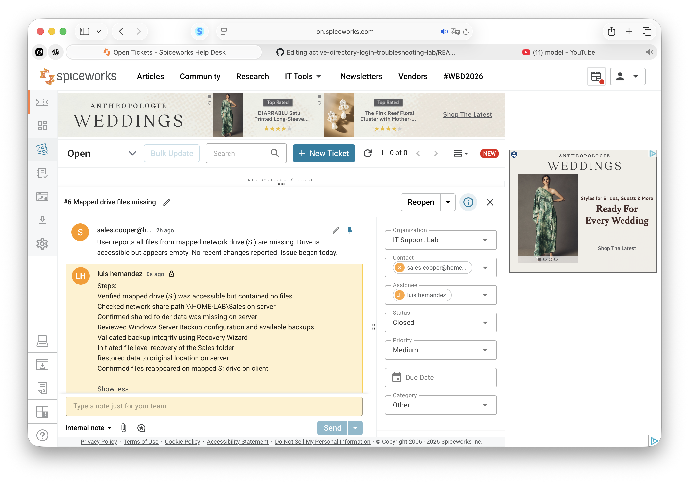

---

## Key Takeaways
- Group Policy can automate drive mapping for users in the correct OU.
- Windows Server Backup can protect shared business data from accidental deletion.
- Verifying the fix from the client side is just as important as fixing it on the server.
- A complete troubleshooting workflow includes setup, failure confirmation, recovery, validation, and ticket closure.